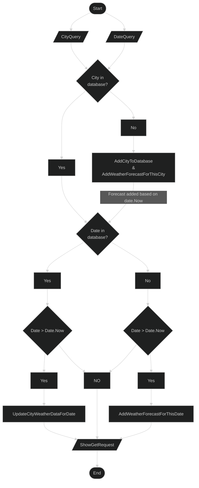

# Flowchart GetWeatherForecastByDateCommand

```mermaid
%%{init: {'theme': 'dark', 'themeVariables': { 'fontSize': '13px'}}}%%

%% THEMES: base, forest, dark, default, neutral %%

%% SHAPES meaning
%% --------------
%% ([name]) -> Start/End ->     Oval represents a start or a endpoint
%%    -->   -> Arrows    ->     Shows relationships between the shapes
%% [/name/] -> I/O       ->     Parallellogram represents input or output
%% [name]   -> Process   ->     Rectangle represents a process
%% {name}   -> Decision  ->     Diamond indicates a decision


flowchart TD
    A([Start]) -->
    B[/CityQuery/] & C[/DateQuery/] --> D{City in<br>database?}
    D --> Yes --> F
    D --> No --> E[AddCityToDatabase<br>&<br>AddWeatherForecastForThisCity]
    
    
    E --> |Forecast added based on date.Now| F{Date in<br>database?}
    F --> G[Yes] -->
    H{Date > Date.Now} --> O[Yes] 
    O --> I[UpdateCityWeatherDataForDate] 
    I --> Y[/ShowGetRequest/]
    H --> N[NO]
    N --> Y
    Y --> Z([End])
    
    F --> K[No] 
    K --> L{Date > Date.Now}
    L --> P[Yes]
    L --> N
    P --> M[AddWeatherForecastForThisDate]
    M --> Y
```

