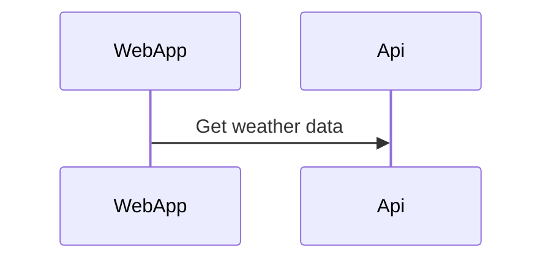

# WeatherSummary

Shared team for getting weather data from different data sources and present that data into a React App. The backend will be a .net core WebAPI.

# Potensial dotnet template

<https://fullstackhero.net/>
<https://github.com/fullstackhero/dotnet-webapi-boilerplate>


## Get the database up and running

---
#### Download SQL Server Management Studio: [SQL Mng Studio](https://docs.microsoft.com/en-us/sql/ssms/download-sql-server-management-studio-ssms?view=sql-server-ver15)
#### Download Docker Desktop: [Docker Desktop](https://www.docker.com/products/docker-desktop/)
---
#### **Pull the server docker image from Microsoft**
```
docker pull mcr.microsoft.com/mssql/server
```

#### Run SQL Server container images with Docker Desktop -> **WITHOUT volume**
```docker
docker run -e "ACCEPT_EULA=Y" -e "SA_PASSWORD=123456a@" -p 1433:1433 -d mcr.microsoft.com/mssql/server:2019-latest
```
#### RUN SQL Server container images with Docker Desktop -> **WITH volume**
```docker
docker run -e "ACCEPT_EULA=Y" -e "SA_PASSWORD=123456a@" -p 1433:1433 -v Sql-server-storage:/var/opt/mssql  -d mcr.microsoft.com/mssql/server:2019-latest
```
#### **Create Docker Network**
```docker
docker network create YourNetWorkName
```
[Docker SQL Server Documentation](https://hub.docker.com/_/microsoft-mssql-server) 

---

## Backend setup
[Visual Studio w/ docker-compose](/WeatherWebAPI/WeatherWebAPI/README_VisualStudioSetup.md)

[SQL Server Management Studio](/WeatherWebAPI/WeatherWebAPI/README_SQLServerManagementStudioSetup.md)

[Make Self Signed HTTPS Certificate](/WeatherWebAPI/WeatherWebAPI/README_SelfSignedHttpsCertificate.md)

# Mark down stuff

[mermaid](https://mermaid-js.github.io/mermaid/#/)
Visual studio extension -> Markdown Preview Mermaid Support


# Backlog

## Back end

[Backend specs](/Backlog/BackEnd.md/#back-end)

## Web application

[Web specs](/Backlog/WebApp.md)

## Azure devops

[Azure devops](/Backlog/AzDevOps.md)

# API endpoint(s)
> GET /api/weatherforecast/date?DateQuery.Date={Date}&CityQuery.City={cityName}

> GET /api/weatherforecast/between?BetweenDateQuery.From={fromDate}&BetweenDateQuery.To={toDate}&CityQuery.City={cityName}

> GET /api/weatherforecast/week?week={weekNumber}&City={cityName}

