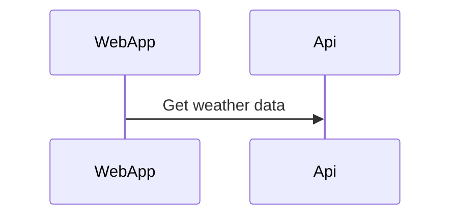

# WeatherSummary
Shared team for getting weather data from different data sources and present that data into a React App. The backend will be a .net core WebAPI.


# Potensial dotnet template 
https://fullstackhero.net/
https://github.com/fullstackhero/dotnet-webapi-boilerplate

# Get the database up and running

[MS SQL docker image](https://hub.docker.com/_/microsoft-mssql-server)


### Download SQL Mng Studio
[SQL Mng Studio](https://docs.microsoft.com/en-us/sql/ssms/download-sql-server-management-studio-ssms?view=sql-server-ver15
)

### Run SQL Server
```docker
docker run -e "ACCEPT_EULA=Y" -e "SA_PASSWORD=123456a@" -p 1433:1433 -d mcr.microsoft.com/mssql/server:2019-latest
```

## Download image 
```
docker pull mcr.microsoft.com/mssql/server
```

#Hey! HTML also available 
```htm
<HTML>
    <HEADER>
</HTML>
```


# Mark down stuff
[mermaid](https://mermaid-js.github.io/mermaid/#/)
Visual studio extension -> Markdown Preview Mermaid Support 




<h1>Hey!</h1>
<ul><>

