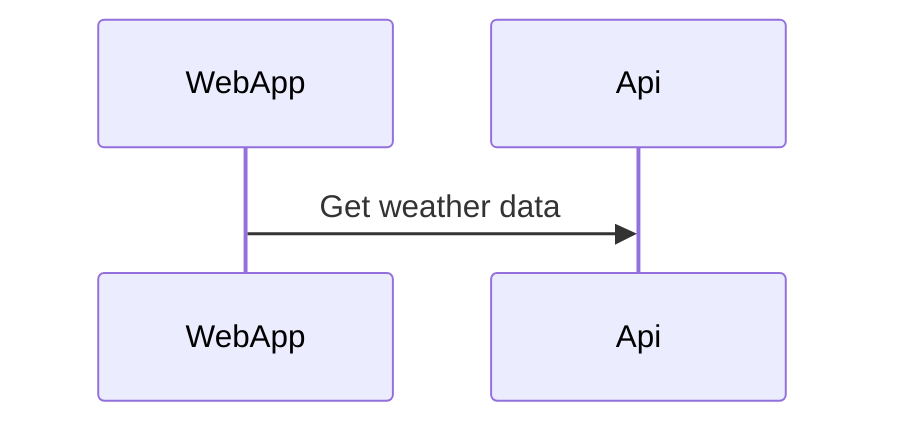

# WeatherSummary

Shared team for getting weather data from different data sources and present that data into a React App. The backend will be a .net core WebAPI.

# Potensial dotnet template

<https://fullstackhero.net/>
<https://github.com/fullstackhero/dotnet-webapi-boilerplate>

# Mark down using Mermaid

About: [Mermaid](https://mermaid-js.github.io/mermaid/#/)

Install Visual Studio Code Extension: [Markdown Preview Mermaid Support](https://marketplace.visualstudio.com/items?itemName=bierner.markdown-mermaid)

Used to draw different diagrams and for code snippets in README.md files.

Example Diagram:

Example Code snippet:

```csharp
    Console.WriteLine("Hello World!");
```

# Get the database up and running
#### Download SQL Server Management Studio: [SQL Mng Studio](https://docs.microsoft.com/en-us/sql/ssms/download-sql-server-management-studio-ssms?view=sql-server-ver15)
#### Download Docker Desktop: [Docker Desktop](https://www.docker.com/products/docker-desktop/)

Documentation & Linux image list: [Docker SQL Server Documentation](https://hub.docker.com/_/microsoft-mssql-server) 

---
#### **Pull the server docker image from Microsoft**
```
docker pull mcr.microsoft.com/mssql/server

docker pull mcr.microsoft.com/mssql/server:2022-latest

docker pull mcr.microsoft.com/mssql/server:2019-latest

... or whatever image of your choosing.
```

mcr.microsoft.com/mssql/server:2019-latest was the latest version available when this project was started. Therefore this image is used throughout the documentation as shown below:

#### **Run SQL Server container *WITH* volume**
Run this command if you need data to be stored.
```docker
docker run -e "ACCEPT_EULA=Y" -e "SA_PASSWORD=YourPassword" -p 1433:1433 -v Sql-server-storage:/var/opt/mssql -d mcr.microsoft.com/mssql/server:2019-latest
```
#### **Run SQL Server container *WITHOUT* volume**
Run this command if you don't need data to be stored.
```docker
docker run -e "ACCEPT_EULA=Y" -e "SA_PASSWORD=YourPassword" -p 1433:1433 -d mcr.microsoft.com/mssql/server:2019-latest
```

#### **Create Docker Network**
For docker compose to work, we need to create a network that all our docker containers share.
```docker
docker network create YourNetworkName
```

#### **Create seperate docker-compose.yml file**
Why? Because then you can run one development, and one production docker container for your application.

***Remember*** to create two different databases aswell (inside your SQL Database image. You don't need to pull two images). You don't want production mixed up with development.
```yml
version: '3.4'

services:
  db:
    container_name: SqlServer
    image: mcr.microsoft.com/mssql/server:2019-latest
    user: root
    ports:
        - "1433:1433"
    volumes:
        - Sql-server-storage:/var/opt/mssql
    environment:
        - ACCEPT_EULA=Y
        - SA_PASSWORD=123456a@
    networks:
        - weather

networks:
    weather:
      external: true

volumes:
  Sql-server-storage:
    external: true
```

# Backend
[README](/WeatherWebAPI/WeatherWebAPI/Documentation/README.md)

# Backlog
### Backend
[Backend specs](/Backlog/BackEnd.md/#back-end)
### Web application
[Web specs](/Backlog/WebApp.md)
### Azure devop
[Azure devops](/Backlog/AzDevOps.md)

# Diagrams
[Entity Relationship Diagram](/EntityRelationshipDiagram.MD)

[Http Design Class Diagram](/WeatherWebAPI/WeatherWebAPI/WeatherWebAPI/Factory/HttpDesign.md)

[Sql Design Class Diagram](/WeatherWebAPI/WeatherWebAPI/WeatherWebAPI/Factory/SqlDesign.md)

# API endpoint(s)

**Cities**
```
POST api/Cities/addCity

GET /api/Cities/getCitiesInDatabase
```
**CompanyRating**
```
GET /api/CompanyRating/avgScoreWeatherProvider

GET /api/CompanyRating/avgScorePredictionLength?Days={days}

GET /api/CompanyRating/avgScoreWeatherProviderForCity?City={cityName}

GET /api/CompanyRating/avgScorePredictionLengthAndCity?DaysQuery.Days={days}&CityQuery.City={cityName}
```
**WeatherForecast**
```
GET /api/WeatherForecast/predictionByDate?DateQuery.Date={date}&CityQuery.City={cityName}

GET /api/WeatherForecast/date?DateQuery.Date={date}&CityQuery.City={cityName}

GET /api/WeatherForecast/between?BetweenDateQuery.From={fromDate}&BetweenDateQuery.To={toDate}&CityQuery.City={cityName}

GET /api/WeatherForecast/week?week={weekNumber}&City={cityName}

GET /api/WeatherForecast/getCitiesInDatabase
```
