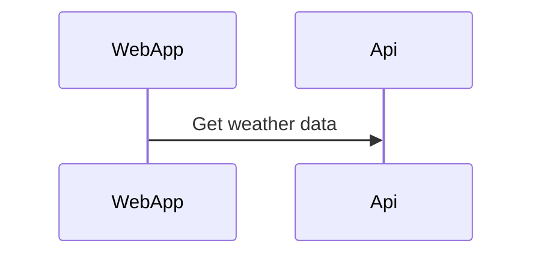

# WeatherSummary

Shared team for getting weather data from different data sources and present that data into a React App. The backend will be a .net core WebAPI.

# Potensial dotnet template

<https://fullstackhero.net/>
<https://github.com/fullstackhero/dotnet-webapi-boilerplate>


## Get the database up and running

---
#### Download SQL Server Management Studio: [SQL Mng Studio](https://docs.microsoft.com/en-us/sql/ssms/download-sql-server-management-studio-ssms?view=sql-server-ver15)
---
### **Download image**
---
#### **Pull the docker image from Microsoft**
```
docker pull mcr.microsoft.com/mssql/server
```

#### **Run SQL Server container images with Docker Desktop -> WITHOUT volume**
```docker
docker run -e "ACCEPT_EULA=Y" -e "SA_PASSWORD=123456a@" -p 1433:1433 -d mcr.microsoft.com/mssql/server:2019-latest
```
#### **RUN SQL Server container images with Docker Desktop -> WITH volume**
```docker
docker run -e "ACCEPT_EULA=Y" -e "SA_PASSWORD=123456a@" -p 1433:1433 -v Sql-server-storage:/var/opt/mssql  -d mcr.microsoft.com/mssql/server:2019-latest
```
#### **Create docker network**
```docker
docker network create YourNetWorkName
```
[Documentation](https://hub.docker.com/_/microsoft-mssql-server) 

---
### **Visual Studio setup**
---

#### **appsettings.json**
```json
{
  "ConnectionStrings": {
    "WeatherForecastDatabase": "Data Source=SqlServer,1433;Initial Catalog=DB;User ID=sa; Password=123456a@;Connect Timeout=99999;Encrypt=False;TrustServerCertificate=False;ApplicationIntent=ReadWrite;MultiSubnetFailover=False"
  },

  "Logging": {
    "LogLevel": {
      "Default": "Information",
      "Microsoft.AspNetCore": "Warning"
    }
  },
  "AllowedHosts": "*"
}
```
#### **Docker-compose.yml**
```csharp
version: '3.4'

services:
  weatherwebapi:
    image: ${DOCKER_REGISTRY-}weatherwebapi
    build:
      context: .
      dockerfile: WeatherWebAPI/Dockerfile
    networks: 
            - default   
  db:
    container_name: SqlServer
    image: mcr.microsoft.com/mssql/server 
    ports:
      - 1433:1433
    volumes:
      - Sql-server-storage:/var/opt/mssql
    environment:
      - ACCEPT_EULA=Y
      - SA_PASSWORD=123456a@
    networks: 
            - default
networks:
  default:
    external:
      name: weather

volumes:
  Sql-server-storage:
    external: true
    
```
---
### **SQL Server Management Studio**
---
> Connect to the database
- Username: sa
- Password: 123456a@
> Create the database using the newest script
- Remember to add fake data (if the backend still can't fetch this from the internet)
# Mark down stuff

[mermaid](https://mermaid-js.github.io/mermaid/#/)
Visual studio extension -> Markdown Preview Mermaid Support



# Backlog

## Back end

[Backend specs](/Backlog/BackEnd.md/#back-end)

## Web application

[Web specs](/Backlog/WebApp.md)

## Azure devops

[Azure devops](/Backlog/AzDevOps.md)

# API endpoint(s)
> GET /api/weatherforecast/date?DateQuery.Date=[Date]&CityQuery.City=[cityName]

> GET /api/weatherforecast/between?BetweenDateQuery.From=[fromDate]&BetweenDateQuery.To=[toDate]&CityQuery.City=[cityName]

> GET /api/weatherforecast/week?week=[weekNumber]&City=[cityName]

