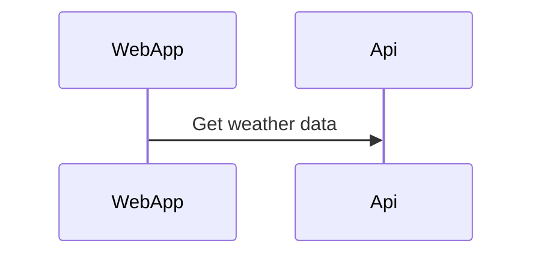

# WeatherSummary

Shared team for getting weather data from different data sources and present that data into a React App. The backend will be a .net core WebAPI.

# Potensial dotnet template

<https://fullstackhero.net/>
<https://github.com/fullstackhero/dotnet-webapi-boilerplate>

# Mark down using Mermaid

About: [Mermaid](https://mermaid-js.github.io/mermaid/#/)

Install Visual Studio Code Extension: [Markdown Preview Mermaid Support](https://marketplace.visualstudio.com/items?itemName=bierner.markdown-mermaid)

Used to draw different diagrams and for code snippets in README.md files.

Example Diagram:



Example Code snippet:

```csharp
    Console.WriteLine("Hello World!");
```

# Running the Backend Application

**1.** Download Docker Desktop: [Here](https://www.docker.com/products/docker-desktop/)

**2.** Download SQL Server Management Studio: [Here](https://docs.microsoft.com/en-us/sql/ssms/download-sql-server-management-studio-ssms?view=sql-server-ver15) -> or connect to the database using visual studio or some other program of your choosing.

**3.** Pull SQL Server [image](/README.md/#pull-the-server-docker-image-from-microsoft)

**4.** Create a docker network for the different containers you're about run later on using a terminal window:

```powershell
docker network create weather
```

**5.** Locate **_sqldb-compose_** in the git repository (../WeatherWebAPI/WeatherWebAPI/sqldb-compose), and run the docker compose in a terminal window:

```powershell
docker compose up -d
```

**6.** See that you're SQL Server container is running either by using the Docker Desktop program or by running command:

```powershell
docker ps
```

**7.** Now we need to connect to our database and physically create the database with a name of our choosing.

```
username: sa
password: 123456a@
```

The server is running on localhost (127.0.0.1) on port: 1433. When you have connected, create a database with whatever name you prefer.

**8.** Now run the script inside SQL Server Management Studio to fill your database with the correct tables.
The Script is located in the root folder and is called: CreateDatabaseScript.sql.

**9.** Before we run the docker compose file located in the **_WeatherForecast-compose_**-folder, we need to build the docker image. Because of Visual Studio creating the dockerfiles and compose for us, we need to change the connection string inside **appsettings.json**;

```json
"WeatherForecastDatabase": "Data Source=SqlServer,1433;Initial Catalog=WeatherForecast;User ID=sa;Password=123456a@;Connect Timeout=120;Encrypt=False;TrustServerCertificate=False;ApplicationIntent=ReadWrite;MultiSubnetFailover=False"
```

change **_Initial Catalog_** inside the connection string:

```json
"Initial Catalog=YOURDATABASENAME"
```

and then build the image using the main docker compose file located in: ../WeatherWebAPI/WeatherWebAPI. Run command in terminal:

```powershell
docker compose up -d
```

**9.** The image will now be built and run up a container with the name "WeatherForecast_dev".

Stop this container inside Docker Desktop or using the terminal commands:

List all containers running

```powershell
docker ps
```

```powershell
docker stop containerId #or by name -> docker stop WeatherForecast_dev
```

```powershell
docker rm containerId #or by name -> docker rm WeatherForecast_dev
```

You could try to run the remove one straight away, but it could cause issues. Therefore we've given you all the commands you need to safely remove a container.

**10.** Now allocate the **_WeatherForecast-compose_**-folder and run the terminal command once more:

```powershell
docker compose up -d
```

**11.** The backend should now be working fine. If you want to continue development on a different dev-database. Create one as shown above and run the same script. Now you do the rest from Microsoft Visual Studio. Change the connection string and compile it inside Visual Studio. Visual Studio will create a new image for you and run everything on the dev specifications.

# Get the database up and running

#### Download SQL Server Management Studio: [SQL Mng Studio](https://docs.microsoft.com/en-us/sql/ssms/download-sql-server-management-studio-ssms?view=sql-server-ver15)

#### Download Docker Desktop: [Docker Desktop](https://www.docker.com/products/docker-desktop/)

Documentation & Linux image list: [Docker SQL Server Documentation](https://hub.docker.com/_/microsoft-mssql-server)

---

#### **Pull the server docker image from Microsoft**

```
docker pull mcr.microsoft.com/mssql/server

docker pull mcr.microsoft.com/mssql/server:2022-latest

docker pull mcr.microsoft.com/mssql/server:2019-latest

... or whatever image of your choosing.
```

mcr.microsoft.com/mssql/server:2019-latest was the latest version available when this project was started. Therefore this image is used throughout the documentation as shown below:

#### **Run SQL Server container _WITH_ volume**

Run this command if you need data to be stored.

```docker
docker run -e "ACCEPT_EULA=Y" -e "SA_PASSWORD=YourPassword" -p 1433:1433 -v Sql-server-storage:/var/opt/mssql -d mcr.microsoft.com/mssql/server:2019-latest
```

#### **Run SQL Server container _WITHOUT_ volume**

Run this command if you don't need data to be stored.

```docker
docker run -e "ACCEPT_EULA=Y" -e "SA_PASSWORD=YourPassword" -p 1433:1433 -d mcr.microsoft.com/mssql/server:2019-latest
```

#### **Create Docker Network**

For docker compose to work, we need to create a network that all our docker containers share.

```docker
docker network create YourNetworkName
```

#### **Create seperate docker-compose.yml file**

Why? Because then you can run one development, and one production docker container for your application.

**_Remember_** to create two different databases aswell (inside your SQL Database image. You don't need to pull two images). You don't want production mixed up with development.

```yml
version: "3.4"

services:
  db:
    container_name: SqlServer
    image: mcr.microsoft.com/mssql/server:2019-latest
    user: root
    ports:
      - "1433:1433"
    volumes:
      - Sql-server-storage:/var/opt/mssql
    environment:
      - ACCEPT_EULA=Y
      - SA_PASSWORD=123456a@
    networks:
      - weather

networks:
  weather:
    external: true

volumes:
  Sql-server-storage:
    external: true
```

# Backend

[README](/WeatherWebAPI/WeatherWebAPI/Documentation/README.md)

# Backlog

### Backend

[Backend specs](/Backlog/BackEnd.md/#back-end)

### Web application

[Web specs](/Backlog/WebApp.md)

### Azure devop

[Azure devops](/Backlog/AzDevOps.md)

# Diagrams

[Entity Relationship Diagram](/EntityRelationshipDiagram.MD)

[Http Design Class Diagram](/WeatherWebAPI/WeatherWebAPI/WeatherWebAPI/Factory/HttpDesign.md)

[Sql Design Class Diagram](/WeatherWebAPI/WeatherWebAPI/WeatherWebAPI/Factory/SqlDesign.md)

# API endpoint(s)

**Cities**

```
POST api/Cities/addCity

GET /api/Cities/getCitiesInDatabase
```

**CompanyRating**

```
GET /api/CompanyRating/avgScoreWeatherProvider

GET /api/CompanyRating/avgScorePredictionLength?Days={days}

GET /api/CompanyRating/avgScoreWeatherProviderForCity?City={cityName}

GET /api/CompanyRating/avgScorePredictionLengthAndCity?DaysQuery.Days={days}&CityQuery.City={cityName}
```

**WeatherForecast**

```
GET /api/WeatherForecast/predictionByDate?DateQuery.Date={date}&CityQuery.City={cityName}

GET /api/WeatherForecast/date?DateQuery.Date={date}&CityQuery.City={cityName}

GET /api/WeatherForecast/between?BetweenDateQuery.From={fromDate}&BetweenDateQuery.To={toDate}&CityQuery.City={cityName}

GET /api/WeatherForecast/week?week={weekNumber}&City={cityName}

GET /api/WeatherForecast/getCitiesInDatabase
```
