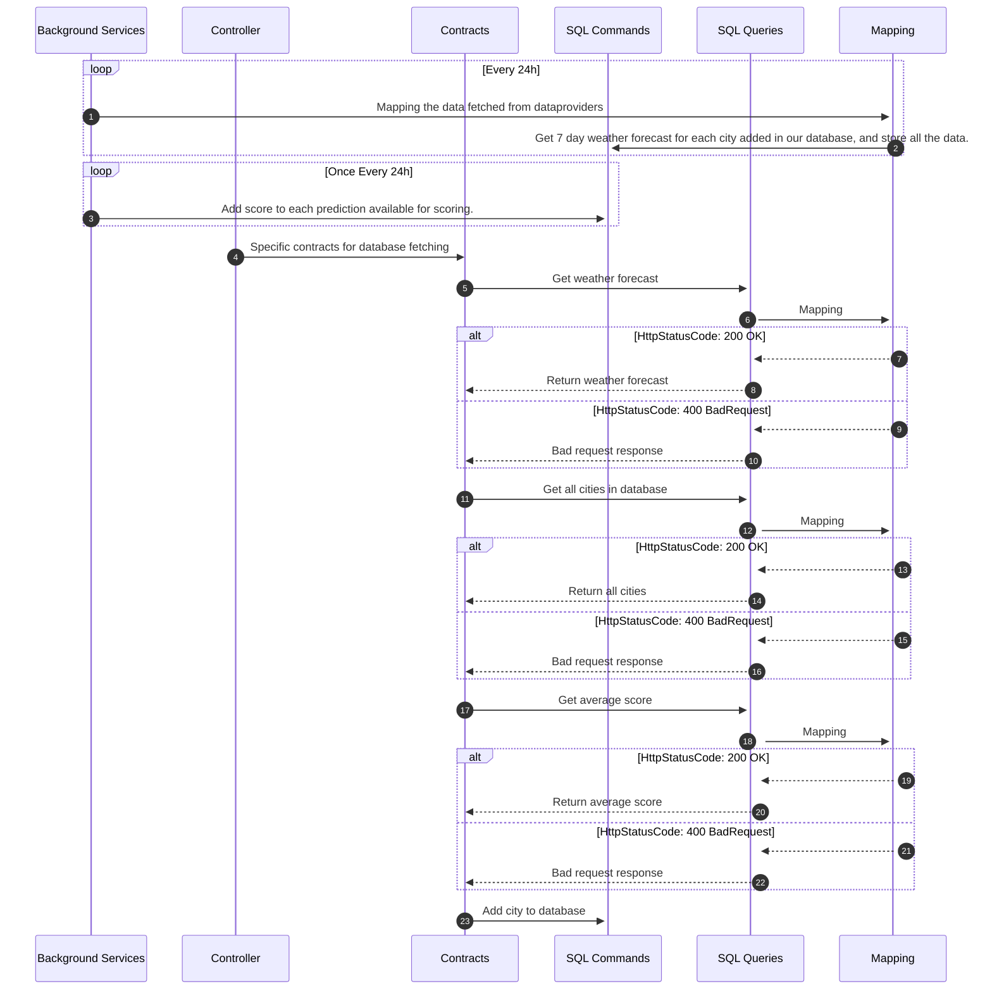

Controller
- Contracts
    - SQL commands
        - Mapping
    - SQL queries
        - GetWeatherForecast -> mapping between WeatherForecast and WeatherForecastDto
        - Get Cities
        - Get AverageScores

Background Services
- CalculateScore
- GetWeatherData from Weather Sources (rename?? because of the other query names?)
---
