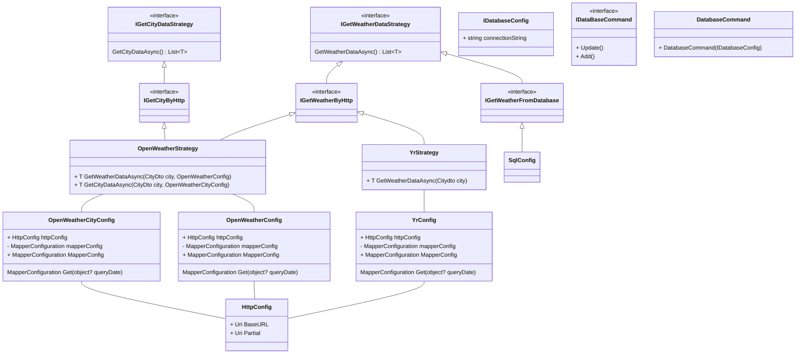

```mermaid 
classDiagram 
    class IGetWeatherDataStrategy {
        <<interface>>
        GetWeatherDataAsync() List~T~
    }
    IGetWeatherDataStrategy <|-- IGetWeatherByHttp
    IGetWeatherDataStrategy <|-- IGetWeatherFromDatabase

        class IGetCityDataStrategy {
        <<interface>>
        GetCityDataAsync() List~T~
    }
    IGetCityDataStrategy <|-- IGetCityByHttp


    class IGetWeatherByHttp {
        <<interface>>

    }
    IGetWeatherByHttp <|-- OpenWeatherStrategy
    IGetWeatherByHttp <|-- YrStrategy


    class IGetCityByHttp {
        <<interface>>

    }
    IGetCityByHttp <|-- OpenWeatherStrategy


    class IGetWeatherFromDatabase {
        <<interface>>
    }
    IGetWeatherFromDatabase <|-- SqlConfig


    class YrStrategy {
        + T GetWeatherDataAsync(Citydto city) 
    }
    YrStrategy -- YrConfig


    class OpenWeatherStrategy {
        + T GetWeatherDataAsync(CityDto city, OpenWeatherConfig)
        + T GetCityDataAsync(CityDto city, OpenWeatherCityConfig)
    }
    OpenWeatherStrategy -- OpenWeatherConfig
    OpenWeatherStrategy -- OpenWeatherCityConfig


    class YrConfig {
        + HttpConfig httpConfig
        - MapperConfiguration mapperConfig
        + MapperConfiguration MapperConfig
        MapperConfiguration Get(object? queryDate)
    }
    YrConfig -- HttpConfig


      class OpenWeatherConfig {
        + HttpConfig httpConfig
        - MapperConfiguration mapperConfig
        + MapperConfiguration MapperConfig
        MapperConfiguration Get(object? queryDate)
    }
    OpenWeatherConfig -- HttpConfig


      class OpenWeatherCityConfig {
        + HttpConfig httpConfig
        - MapperConfiguration mapperConfig
        + MapperConfiguration MapperConfig
        MapperConfiguration Get(object? queryDate)
    }
    OpenWeatherCityConfig -- HttpConfig


    class HttpConfig {
        + Uri BaseURL
        + Uri Partial
    }


    class IDatabaseConfig {
        + string connectionString
    }

    class IDataBaseCommand {
        <<interface>>

        + Update()
        + Add()
    }

    class DatabaseCommand {
        + DatabaseCommand(IDatabaseConfig)
    }
```