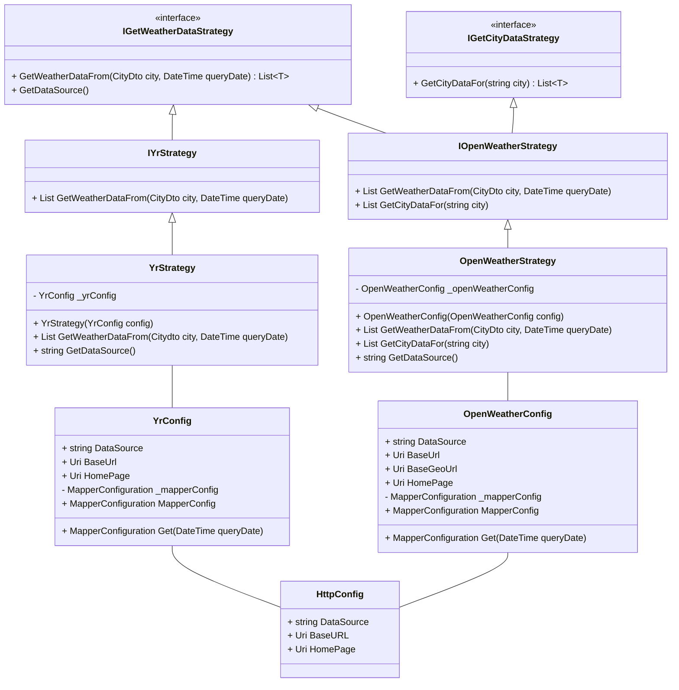

```mermaid 
classDiagram 
    
    class IGetWeatherDataStrategy {
        <<interface>>

        + GetWeatherDataFrom(CityDto city, DateTime queryDate) List~T~
        + GetDataSource()
    }
    IGetWeatherDataStrategy <|-- IOpenWeatherStrategy
    IGetWeatherDataStrategy <|-- IYrStrategy

        class IGetCityDataStrategy {
        <<interface>>

        + GetCityDataFor(string city) List~T~
    }
    IGetCityDataStrategy <|-- IOpenWeatherStrategy


    class IYrStrategy {

        + List<WeatherForecast> GetWeatherDataFrom(CityDto city, DateTime queryDate)
    }
    IYrStrategy <|-- YrStrategy
    YrStrategy -- YrConfig

    class YrStrategy {

        - YrConfig _yrConfig
        + YrStrategy(YrConfig config)

        + List<WeatherForecast> GetWeatherDataFrom(Citydto city, DateTime queryDate)
        + string GetDataSource()
    }


    class IOpenWeatherStrategy {

        + List<WeatherForecast> GetWeatherDataFrom(CityDto city, DateTime queryDate)
        + List<CityDto> GetCityDataFor(string city)
    }
    IOpenWeatherStrategy <|-- OpenWeatherStrategy
    OpenWeatherStrategy -- OpenWeatherConfig

    class OpenWeatherStrategy {

        - OpenWeatherConfig _openWeatherConfig
        + OpenWeatherConfig(OpenWeatherConfig config)

        + List<WeatherForecast> GetWeatherDataFrom(CityDto city, DateTime queryDate)
        + List<CityDto> GetCityDataFor(string city)

        + string GetDataSource()
    }


    class YrConfig {

        + string DataSource
        + Uri BaseUrl
        + Uri HomePage

        - MapperConfiguration _mapperConfig
        + MapperConfiguration MapperConfig
        + MapperConfiguration Get(DateTime queryDate)
    }
    YrConfig -- HttpConfig


      class OpenWeatherConfig {

        + string DataSource
        + Uri BaseUrl
        + Uri BaseGeoUrl
        + Uri HomePage
        - MapperConfiguration _mapperConfig
        + MapperConfiguration MapperConfig
        + MapperConfiguration Get(DateTime queryDate)
    }
    OpenWeatherConfig -- HttpConfig


      %%class OpenWeatherCityConfig {
       %%  + HttpConfig httpConfig
       %% - MapperConfiguration mapperConfig
       %% + MapperConfiguration MapperConfig
       %% MapperConfiguration Get(object? queryDate)
    %%}
    %%OpenWeatherCityConfig -- HttpConfig


    class HttpConfig {

        + string DataSource
        + Uri BaseURL
        + Uri HomePage
    }

```